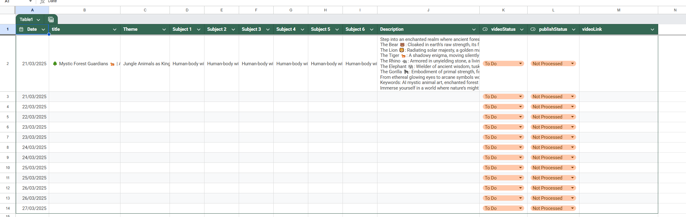

# n8n-flows
Repository for storing n8n flows

## Overview
This repository contains a collection of n8n workflows for automating various AI-powered content generation tasks. The main workflow (Generate Shorts) orchestrates the entire content creation pipeline by utilizing the AI Image and AI Video generation flows to produce engaging short-form content.

## Available Flows

### 1. Generate Shorts (Main Orchestrator)

This is the main orchestrator workflow that coordinates the entire content creation pipeline. It manages the process from content planning to final publication by utilizing the AI Image and AI Video generation flows.

**Content Planning:**

The workflow uses a Google Sheets template to manage content ideas and track the generation process. The template includes:
- Content subjects and themes
- Video status tracking
- Country-specific content
- Publishing metadata

**Features:**
- Orchestrates the entire content creation pipeline
- Automated video rendering using Creatomate
- YouTube integration for direct publishing
- Google Sheets integration for content management
- Scheduled execution capability
- Support for multiple video subjects and templates

**Technical Details:**
- Uses Creatomate for video rendering (1080x1920 resolution)
- Integrates with Google Sheets for content tracking
- Supports YouTube upload with metadata
- Includes video status tracking and management
- Template-based video generation with customizable elements

**Workflow Process:**
1. Retrieves content ideas from Google Sheets
2. Triggers AI Image generation for each subject
3. Processes generated images through AI Video generation
4. Combines multiple videos into a final short-form video
5. Renders the final video using Creatomate
6. Uploads to YouTube and updates tracking in Google Sheets

### 2. Generate AI Image

This workflow automates the process of generating AI images using Midjourney through the PiAPI service. It is used as a component within the Generate Shorts workflow to create base images for video generation.

**Features:**
- Uses Midjourney model for high-quality image generation
- Supports custom aspect ratios (default 9:16)
- Includes image upscaling using Qubico/flux1-dev-advanced model
- Automatic error handling and status checking
- Configurable prompt input

**Technical Details:**
- Integrates with PiAPI for Midjourney access
- Implements outpainting for image expansion
- Includes wait times for processing (15-second intervals)
- Handles multiple status states (processing, completed, failed)

### 3. Generate AI Video

This workflow creates AI-generated videos from images using the Kling AI service. It is called by the Generate Shorts workflow to transform the generated images into dynamic video content.

**Features:**
- Converts static images into dynamic videos
- Uses GPT-4 for intelligent prompt generation
- Supports 10-second video generation
- Professional mode video processing
- JWT-based authentication for API access

**Technical Details:**
- Integrates with OpenAI for prompt analysis
- Uses Kling AI's image2video API
- Implements status checking and error handling
- Supports custom video duration and configuration
- Includes automatic token generation for API access

## Setup Instructions
1. Import all three flow JSON files into your n8n instance
2. Configure the necessary credentials:
   - PiAPI key for image generation
   - OpenAI API key for video prompts
   - Kling AI credentials for video generation
   - YouTube API credentials for publishing
   - Google Sheets API access for content management
3. Adjust the workflow parameters according to your needs
4. Activate the main Generate Shorts workflow

## Requirements
- n8n instance (self-hosted or cloud)
- Appropriate API keys for:
  - PiAPI (for Midjourney access)
  - OpenAI (for prompt generation)
  - Kling AI (for video generation)
  - YouTube (for video publishing)
  - Google Sheets (for content management)
- Sufficient storage for generated content
- Internet connection for API access

## Contributing
Feel free to submit issues and enhancement requests!

