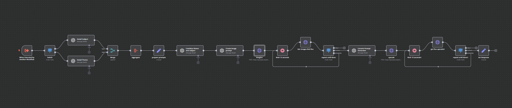
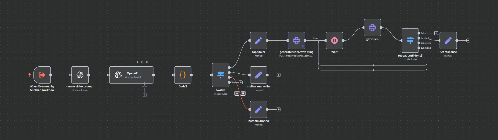
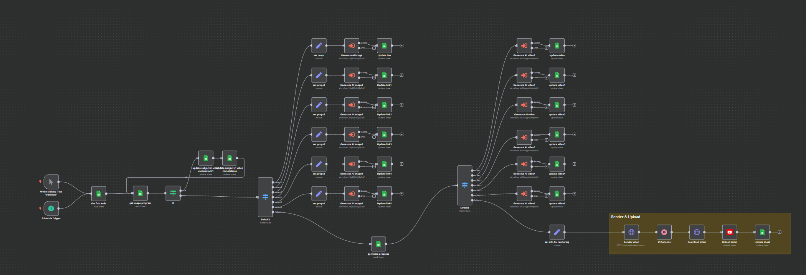

# n8n-flows
Repository for storing n8n flows

## Overview
This repository contains a collection of n8n workflows for automating various AI-powered content generation tasks. Each flow is designed to work with different AI services to create unique content.

## Available Flows

### 1. Generate AI Image

This workflow automates the process of generating AI images using Midjourney through the PiAPI service.

**Features:**
- Uses Midjourney model for high-quality image generation
- Supports custom aspect ratios (default 9:16)
- Includes image upscaling using Qubico/flux1-dev-advanced model
- Automatic error handling and status checking
- Configurable prompt input

**Technical Details:**
- Integrates with PiAPI for Midjourney access
- Implements outpainting for image expansion
- Includes wait times for processing (15-second intervals)
- Handles multiple status states (processing, completed, failed)

### 2. Generate AI Video

This workflow creates AI-generated videos from images using the Kling AI service.

**Features:**
- Converts static images into dynamic videos
- Uses GPT-4 for intelligent prompt generation
- Supports 10-second video generation
- Professional mode video processing
- JWT-based authentication for API access

**Technical Details:**
- Integrates with OpenAI for prompt analysis
- Uses Kling AI's image2video API
- Implements status checking and error handling
- Supports custom video duration and configuration
- Includes automatic token generation for API access

### 3. Generate Shorts

This workflow automates the creation and publishing of short-form videos for social media platforms.

**Features:**
- Automated video rendering using Creatomate
- YouTube integration for direct publishing
- Google Sheets integration for content management
- Scheduled execution capability
- Support for multiple video subjects and templates

**Technical Details:**
- Uses Creatomate for video rendering (1080x1920 resolution)
- Integrates with Google Sheets for content tracking
- Supports YouTube upload with metadata
- Includes video status tracking and management
- Template-based video generation with customizable elements

## Setup Instructions
1. Import the desired flow JSON file into your n8n instance
2. Configure the necessary credentials:
   - PiAPI key for image generation
   - OpenAI API key for video prompts
   - Kling AI credentials for video generation
   - YouTube API credentials for publishing
   - Google Sheets API access for content management
3. Adjust the workflow parameters according to your needs
4. Activate the workflow

## Requirements
- n8n instance (self-hosted or cloud)
- Appropriate API keys for:
  - PiAPI (for Midjourney access)
  - OpenAI (for prompt generation)
  - Kling AI (for video generation)
  - YouTube (for video publishing)
  - Google Sheets (for content management)
- Sufficient storage for generated content
- Internet connection for API access

## Contributing
Feel free to submit issues and enhancement requests!

