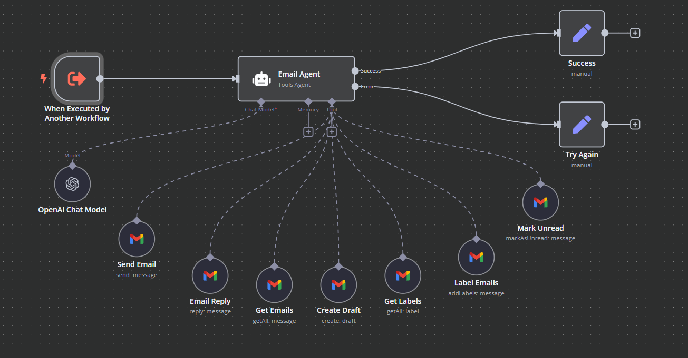

# Personal Assistant

A comprehensive personal assistant system that integrates multiple specialized agents to handle various tasks through Telegram.

## Overview
This project implements an AI-powered personal assistant that can handle various tasks through Telegram, including email management, calendar operations, and content creation. The system uses GPT-4 for intelligent request processing and maintains conversation context for more natural interactions.

## Components

### 1. Personal Assistant (Main Orchestrator)

The main orchestrator that manages user interactions and routes requests to specialized agents.

**Features:**
- Telegram integration for user interaction
- Intelligent request routing to specialized agents
- Memory management for context-aware responses
- Support for both text and voice messages
- Integration with multiple specialized agents

**Technical Details:**
- Uses GPT-4 for intelligent request processing
- Implements window buffer memory for context retention
- Integrates with specialized agents:
  - Email Agent
  - Calendar Agent
  - Content Creator Agent
- Includes calculator functionality
- Supports voice message processing

**Workflow Process:**
1. Receives user input via Telegram
2. Processes and understands the request
3. Routes to appropriate specialized agent
4. Maintains conversation context
5. Returns response to user

### 2. Email Agent

Specialized agent for handling email-related tasks through Gmail integration.

**Features:**
- Email composition and sending
- Contact information lookup
- Email management and organization
- Integration with Gmail

**Technical Details:**
- Gmail API integration
- Contact management
- Email template support
- Automated email scheduling

### 3. Calendar Agent

Specialized agent for managing calendar events and schedules.

**Features:**
- Event creation and management
- Schedule coordination
- Attendee management
- Calendar integration

**Technical Details:**
- Calendar API integration
- Event scheduling and management
- Attendee coordination
- Calendar synchronization

### 4. Content Creator Agent

Specialized agent for creating and managing content.

**Features:**
- Content generation
- Blog post creation
- Content optimization
- Publishing management

## Setup Instructions
1. Import all JSON files into your n8n instance:
   - `personal_assistant.json`
   - `gmail_agent.json`
   - `calendar_agent.json`
   - `content_creator_agent.json`

2. Configure the necessary credentials:
   - OpenAI API key for GPT-4
   - Telegram Bot token
   - Gmail API credentials
   - Calendar API credentials

3. Adjust the workflow parameters according to your needs

4. Activate the main Personal Assistant workflow

## Requirements
- n8n instance (self-hosted or cloud)
- OpenAI API access
- Telegram Bot
- Gmail account with API access
- Calendar service with API access
- Internet connection for API access

## Usage
1. Start a conversation with your Telegram bot
2. Send commands or requests in natural language
3. The assistant will:
   - Understand your request
   - Route it to the appropriate agent
   - Execute the task
   - Provide feedback

## Contributing
Feel free to submit issues and enhancement requests! 