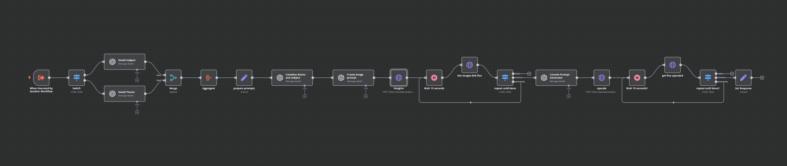

# Shorts Generator

An automated content generation system that creates engaging short-form videos using AI-powered image and video generation.

## Overview
This project implements an end-to-end workflow for creating and publishing short-form videos. It combines AI image generation, video creation, and automated publishing to produce engaging content for social media platforms.

## Components

### 1. Generate Shorts (Main Orchestrator)

The main orchestrator that coordinates the entire content creation pipeline.

**Content Planning:**

The workflow uses a Google Sheets template to manage content ideas and track the generation process. The template includes:
- Content subjects and themes
- Video status tracking
- Country-specific content
- Publishing metadata

**Features:**
- Orchestrates the entire content creation pipeline
- Automated video rendering using Creatomate
- YouTube integration for direct publishing
- Google Sheets integration for content management
- Scheduled execution capability
- Support for multiple video subjects and templates

**Technical Details:**
- Uses Creatomate for video rendering (1080x1920 resolution)
- Integrates with Google Sheets for content tracking
- Supports YouTube upload with metadata
- Includes video status tracking and management
- Template-based video generation with customizable elements

**Workflow Process:**
1. Retrieves content ideas from Google Sheets
2. Triggers AI Image generation for each subject
3. Processes generated images through AI Video generation
4. Combines multiple videos into a final short-form video
5. Renders the final video using Creatomate
6. Uploads to YouTube and updates tracking in Google Sheets

### 2. Generate AI Image

Workflow for generating AI images using Midjourney through the PiAPI service.

**Features:**
- Uses Midjourney model for high-quality image generation
- Supports custom aspect ratios (default 9:16)
- Includes image upscaling using Qubico/flux1-dev-advanced model
- Automatic error handling and status checking
- Configurable prompt input

**Technical Details:**
- Integrates with PiAPI for Midjourney access
- Implements outpainting for image expansion
- Includes wait times for processing (15-second intervals)
- Handles multiple status states (processing, completed, failed)

### 3. Generate AI Video

Workflow for creating AI-generated videos from images using the Kling AI service.

**Features:**
- Converts static images into dynamic videos
- Uses GPT-4 for intelligent prompt generation
- Supports 10-second video generation
- Professional mode video processing
- JWT-based authentication for API access

**Technical Details:**
- Integrates with OpenAI for prompt analysis
- Uses Kling AI's image2video API
- Implements status checking and error handling
- Supports custom video duration and configuration
- Includes automatic token generation for API access

## Setup Instructions
1. Import all JSON files into your n8n instance:
   - `generate_shorts.json`
   - `generate_ai_image.json`
   - `generate_ai_video.json`

2. Configure the necessary credentials:
   - PiAPI key for Midjourney access
   - OpenAI API key for video prompts
   - Kling AI credentials
   - YouTube API credentials
   - Google Sheets API access
   - Creatomate API credentials

3. Set up the Google Sheets template for content management

4. Adjust the workflow parameters according to your needs

5. Activate the main Generate Shorts workflow

## Requirements
- n8n instance (self-hosted or cloud)
- PiAPI account with Midjourney access
- OpenAI API access
- Kling AI account
- YouTube channel
- Google Sheets access
- Creatomate account
- Sufficient storage for generated content
- Internet connection for API access

## Usage
1. Add content ideas to the Google Sheets template
2. The workflow will automatically:
   - Generate images for each subject
   - Create videos from the images
   - Combine videos into a final short
   - Upload to YouTube
   - Update tracking in Google Sheets

## Contributing
Feel free to submit issues and enhancement requests! 